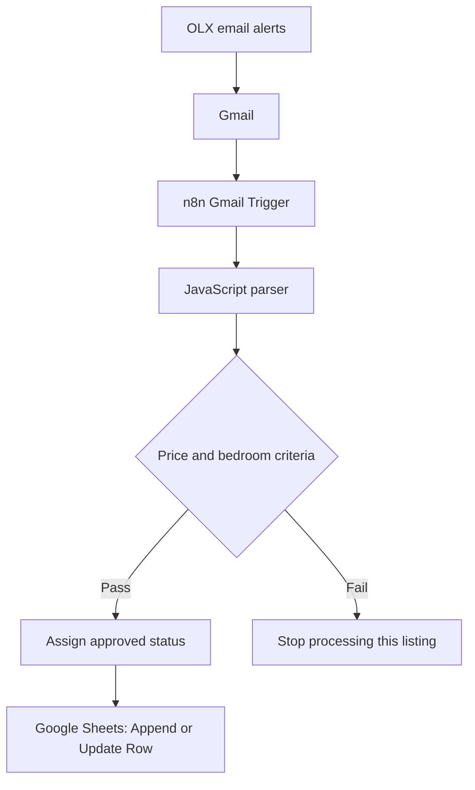

# Rental Scout Automation

**From rental email alerts to a qualified property shortlist — built with n8n, JavaScript, Gmail, and Google Sheets.**

Rental Scout Automation extracts property information from OLX alerts, checks price and bedroom requirements, and updates a shared spreadsheet for human review. It demonstrates a practical automation pattern: turn unstructured incoming information into structured records, apply business rules, and keep an operational dataset current.

**Validated sample:** one email → six listings → five approved records. Repeating the write kept the sheet at five records; reprocessing also restored a manually changed status in an existing row.

[Explore the workflow](workflows/rental-scout-automation-v2.json) · [Setup](#setup) · [Validation](#validation) · [Limitations](#known-limitations)

## Problem and business value

Rental searches involve repeatedly opening email alerts, checking the same requirements, and copying suitable listings into a spreadsheet. Repeated alerts can also create duplicate records.

This workflow automates that initial screening and record maintenance, leaving the shortlist ready for a person to review. The same pattern can inform inbound lead qualification and market monitoring: capture a signal, structure it, apply explicit criteria, and update a shared record. Those are potential applications, not additional integrations implemented here.

The project demonstrates workflow design, service integration, JavaScript data transformation, conditional processing, and practical validation. Time savings and broader parsing accuracy have not been measured.

## Architecture



The export contains five n8n nodes. The Gmail Trigger is configured to check matching messages every minute. The original workflow was published on n8n Cloud; the public export is inactive and needs the importing user's connections and spreadsheet configuration.

| Component | Responsibility |
| --- | --- |
| OLX alerts and Gmail | Supply and receive listing information |
| n8n | Orchestrate ingestion, qualification, and storage |
| JavaScript | Parse email text and convert prices and room counts into numbers |
| IF and field-assignment nodes | Apply rules and assign `status: aprovado` |
| Google Sheets | Provide a reviewable shortlist and update matching records |

V2 uses deterministic parsing and explicit rules. It does not use an LLM or an AI agent; AI-assisted extraction is a possible future extension.

## Processing rules and output

The parser separates listings in the email text, extracts the available fields, and passes them to qualification. Both conditions must hold:

```text
preco <= 2000 AND quartos >= 2
```

The price limit is inclusive: R$2,000 with two bedrooms can pass. Qualification considers the advertised rent and bedroom count, not availability, listing legitimacy, condominium fees, or taxes.

| Field | Meaning |
| --- | --- |
| `titulo` | Listing title |
| `bairro`, `cidade` | Neighborhood and city |
| `preco` | Advertised rent in Brazilian reais |
| `quartos`, `banheiros` | Bedroom and bathroom counts |
| `tipo_imovel` | Property type inferred from the title |
| `url_rastreamento` | Tracking URL extracted from the alert |
| `status` | `aprovado` for listings that pass both rules |

### Record matching

The Google Sheets node uses **Append or Update Row**, matching on `url_rastreamento`. An identical tracking URL updates the existing row; a new key appends a row.

This handles repeated processing of the same key. Different tracking URLs can refer to the same property, so it does not guarantee one row per property. A canonical listing URL or stable listing ID would be a stronger identifier.

## Validation

The previous project validation, recorded on **October 2, 2026**, imported the public JSON into a separate n8n workflow and used a separate spreadsheet. The sample included listings from **Florianópolis** and **Imbituba**, Santa Catarina, Brazil.

| Manual check | Recorded result |
| --- | --- |
| Import the public JSON | All five nodes and their connections were present |
| Connect Gmail and Google Sheets | Credentials and the validation destination were configured privately |
| Retrieve and parse one matching email | Six listing records were extracted |
| Apply qualification | Five passed; a one-bedroom listing was excluded |
| Check the inclusive price boundary | Listings at R$2,000 with two bedrooms passed |
| Assign status and write to an empty sheet | Five records were created with `status: aprovado` |
| Repeat the write with the same input | The sheet remained at five records |
| Change a stored status, then reprocess | `teste` became `aprovado` without adding a row |

These are recorded manual checks, not an automated test suite or a new execution performed for this documentation update. The original workflow was published as **V2 Final - Production**. The separate validation copy remained unpublished, so its scheduled execution was not tested.

The sample did not establish behavior for prices above R$2,000, missing required fields, multiple emails in one execution, or other n8n installations and versions. Long-term reliability remains unmeasured.

## Design decisions

| Decision | Why it fits this use case |
| --- | --- |
| Use email alerts as the input | Work with information already delivered to the inbox |
| Keep qualification explicit | Make decisions transparent and criteria easy to adjust |
| Parse within n8n using JavaScript | Transform the input without an additional application service |
| Use Google Sheets for the output | Give users a familiar interface for reviewing results |
| Validate in a separate workflow and sheet | Check import and update behavior without changing production records |

## Setup

Repository contents:

```text
rental-scout-automation/
├── README.md
└── workflows/
    └── rental-scout-automation-v2.json
```

1. Download [the sanitized V2 export](workflows/rental-scout-automation-v2.json) and import it into an n8n environment that supports its node versions.
2. Select your own Gmail and Google Sheets credentials.
3. Review the Gmail Trigger's sender and subject filters against your OLX alerts. Keep the full email output available: the parser reads the `text` field.
4. In the Google Sheets node, replace `YOUR_SPREADSHEET_ID` and `YOUR_SHEET_NAME` with your destination, or select both from the available lists.
5. Create the following column headers and confirm their mappings:

   ```text
   titulo, bairro, cidade, preco, quartos, banheiros, tipo_imovel, url_rastreamento, status
   ```

6. Confirm **Append or Update Row** matches on `url_rastreamento`, and verify `preco <= 2000 AND quartos >= 2`.
7. Test in a separate sheet. After publishing or activating the workflow, verify a subsequent automatic execution in n8n.

Before unattended use, test the R$2,000 boundary, a price above the limit, one-bedroom rejection, repeated keys, updates to existing rows, and missing fields. The validation table above distinguishes completed checks from work still needed.

## Known limitations

- **Incomplete extraction:** `tipo_imovel` may be `null`; the parser recognizes “apartamento” and “casa” in the extracted title. Some Imbituba neighborhoods are not extracted. A failed location match can also leave city and title empty.
- **Limited template and city coverage:** parsing relies on OLX email text markers and explicitly recognizes Florianópolis and Imbituba. Other cities or changed email formats require parser adjustments.
- **First email only:** the Code node reads `$input.first()`. Multiple email items in one execution need additional handling.
- **Tracking URLs:** stored links are not canonical listing URLs, which limits deduplication across different alerts for the same listing.
- **Missing-field handling:** there is no dedicated validation or review path for missing prices, bedroom counts, or tracking keys.
- **Shortlist lifecycle:** failed items stop at qualification. The workflow does not remove an existing row when a later alert fails the criteria or a listing becomes unavailable.

## Next steps

1. Add missing-field validation and a review queue for incomplete records.
2. Improve location and property-type extraction, and support multiple email inputs.
3. Resolve canonical URLs or stable listing IDs and define how stale records should be handled.
4. Add synthetic fixtures, regression checks, and failure notifications.
5. Measure extraction completeness, processing volume, and review time saved.
6. Evaluate AI-assisted extraction for ambiguous text, with schema validation and human review.

## Public export and privacy

The export preserves the parser, rules, field mappings, and node connections. Credential references, private spreadsheet identifiers, instance metadata, and captured email data are excluded. It contains no personal email addresses or live tracking URLs; the OLX sender filter remains part of the configuration.

Configure authentication privately in n8n. Use synthetic examples in public documentation, and review every updated export before sharing it.
