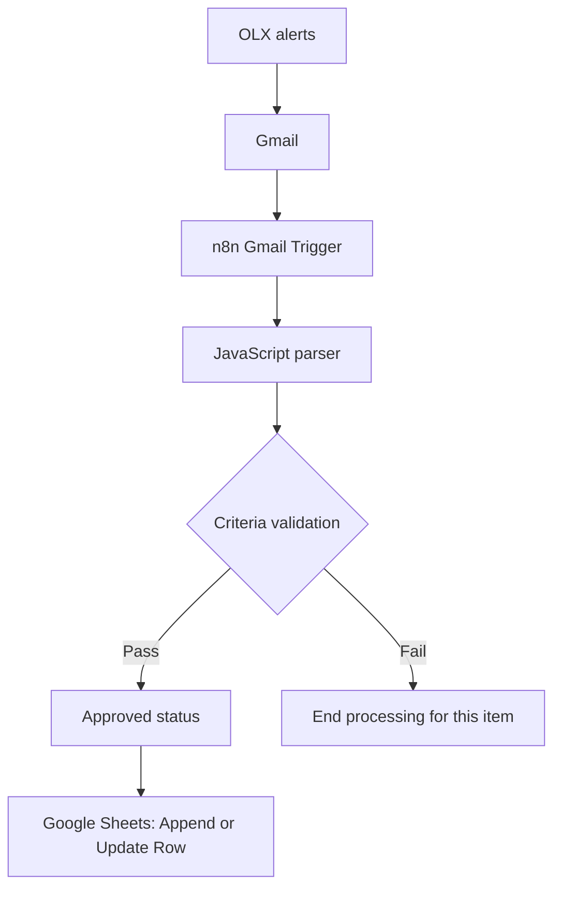

# Rental Scout | n8n

**Turning rental alerts into a structured property shortlist with n8n and JavaScript.**

Rental Scout processes OLX listing alerts received through Gmail, extracts property data, applies price and bedroom criteria, and maintains a Google Sheets shortlist with URL-based deduplication.

Built as a Business & AI automation portfolio project, it demonstrates how to translate a recurring manual task into an integrated workflow with clear business rules.

> **Implementation scope:** V2 uses deterministic JavaScript parsing and rule-based qualification. It does not currently use an LLM or an AI agent. AI-assisted enrichment is a future improvement.

## The Problem

Searching for rental properties involves repeatedly opening alerts, reviewing listings, checking requirements, and copying relevant information into a spreadsheet.

This process creates three practical challenges:

- Relevant information is scattered across email alerts.
- Properties must be checked against the same criteria repeatedly.
- Repeated alerts can create duplicate spreadsheet records.

The goal was to turn incoming alerts into a consistent shortlist for human review.

## The Solution

The workflow connects email ingestion, data extraction, qualification, and storage.

Listings that meet the configured criteria receive an approved status and are saved to Google Sheets. When the same tracking URL is processed again, the existing row is updated instead of creating another record.

This pattern also applies to business workflows such as inbound lead qualification and market monitoring: capture a signal, structure the information, apply rules, and update an operational record.

## Architecture



The Google Sheets step matches records by `url_rastreamento`.

The Gmail Trigger is configured to check for matching messages every minute when the workflow is active. The original workflow is published on **n8n Cloud**, so it does not require a local computer or browser to remain open.

## Technology Stack

| Technology | Role |
| --- | --- |
| OLX email alerts | Source of rental listing information |
| Gmail | Receives the alerts |
| n8n Cloud | Orchestrates the workflow and checks for new messages |
| JavaScript | Parses email content into structured listing records |
| n8n conditional and field-assignment nodes | Apply qualification rules and approved status |
| Google Sheets | Stores the shortlist and updates existing records |

## How It Works

1. **Receive:** OLX sends a rental alert to Gmail.
2. **Detect:** The Gmail Trigger identifies a message matching the configured sender and subject filters.
3. **Parse:** A JavaScript Code node extracts individual listings from the email text and structures the available property information.
4. **Validate:** Each listing is checked against the price and bedroom criteria.
5. **Approve:** Listings that meet both conditions receive the status `aprovado`. Items that fail stop at validation.
6. **Store:** Google Sheets appends a new row or updates an existing row using `url_rastreamento` as the matching key.

### Extracted and Stored Fields

| Field | Meaning |
| --- | --- |
| `titulo` | Listing title |
| `bairro` | Neighborhood |
| `cidade` | City |
| `preco` | Advertised rental price in Brazilian reais |
| `quartos` | Number of bedrooms |
| `banheiros` | Number of bathrooms |
| `tipo_imovel` | Property type inferred from the title |
| `url_rastreamento` | Tracking URL extracted from the alert |
| `status` | Qualification status assigned by the workflow |

The parser converts extracted prices and room counts into numbers. Fields that cannot be extracted may be returned as `null` or an empty string.

### Current Qualification Rules

Both conditions must be true:

```text
preco <= 2000 AND quartos >= 2
```

| Field | Requirement |
| --- | --- |
| `preco` | At most R$2,000 |
| `quartos` | At least 2 bedrooms |

The price limit is inclusive: a listing priced at exactly R$2,000 can pass.

These criteria evaluate the advertised fields. They do not verify availability, listing legitimacy, or total occupancy costs such as condominium fees and taxes.

### Deduplication

The Google Sheets node uses **Append or Update Row**, configured to match on `url_rastreamento`:

- **Matching URL found:** update the existing row.
- **No matching URL found:** append a new row.

This prevents duplicates when an identical tracking URL is processed again.

**Boundary:** different tracking URLs may point to the same listing. The current implementation provides deduplication by tracking URL, rather than guaranteed uniqueness by property. A canonical listing URL or stable listing ID would provide a stronger matching key.

## Validation and Current Status

The original workflow was published on n8n Cloud as **V2 Final - Production** after temporary test nodes were removed.

The public JSON was subsequently imported from GitHub into a separate workflow named **AI Rental Scout | Import Validation**. Existing credentials were selected privately, and the Google Sheets destination was configured to use a separate validation spreadsheet.

### Manual Import and Functional Validation

The following checks were completed on **October 2, 2026**:

| Check | Observed result |
| --- | --- |
| Import the public JSON into a new workflow | All five nodes and their connections were present |
| Configure Gmail and Google Sheets connections | Existing credentials could be selected and the test spreadsheet configured |
| Fetch a matching Gmail message | One email was retrieved with the text field required by the parser |
| Run the JavaScript parser | Six listing records were extracted |
| Apply the qualification criteria | Five listings passed; the one-bedroom listing was excluded from the approved output |
| Check the inclusive price boundary | Listings priced at exactly R$2,000 passed with two bedrooms |
| Assign approval status | All five passing items received `status: aprovado` |
| Write to an empty validation sheet | Five records were created, in rows 2–6 |
| Repeat the write with the same input | The sheet remained at five records |
| Verify an update to an existing row | A status manually changed to `teste` was restored to `aprovado` without adding a row |

The sample contained listings from **Florianópolis** and **Imbituba**, Santa Catarina, Brazil.

The final check demonstrated that the node updated an existing record using the matching key, rather than merely avoiding an additional append.

### Validation Boundaries

These were manual checks performed by executing the imported workflow's nodes in sequence. They are not an automated test suite.

The validation copy remained unpublished; its scheduled execution was not tested. Import into a different n8n installation or version has not been verified.

This sample did not test rejection of a price above R$2,000, handling of missing required fields, or processing multiple emails in one execution. Long-term reliability, broader parsing accuracy, and quantified time savings have not yet been measured.

## Design Decisions

| Decision | Rationale |
| --- | --- |
| Use email alerts as the entry point | Build on information already delivered to the inbox |
| Use explicit qualification rules | Keep decisions transparent and easy to adjust |
| Use JavaScript for parsing | Transform email content within the workflow |
| Store results in Google Sheets | Provide a familiar interface for reviewing the shortlist |
| Match records by tracking URL | Use an available identifier to handle repeated processing |
| Keep the architecture small | Make the workflow easier to understand, maintain, and extend |
| Validate in a separate workflow and sheet | Test the public export without writing to production records |

## Known Limitations

- **Missing property type:** `tipo_imovel` is sometimes `null`. The current logic recognizes “apartamento” or “casa” in the extracted title.
- **Incomplete location extraction:** the neighborhood is not extracted for some Imbituba listings. Because neighborhood, city, and title depend on the same location pattern, a failed match can leave all three fields empty.
- **City-specific parsing:** the current location pattern explicitly recognizes Florianópolis and Imbituba. Supporting other cities requires adapting the parser.
- **Tracking links:** the workflow stores tracking URLs rather than final listing URLs.
- **Email-format dependency:** extraction relies on text markers and formatting in the alert. Template changes may affect results.
- **First-input processing:** the Code node reads `$input.first()`. Processing multiple email items in one execution requires reviewing this behavior.
- **Incomplete-record handling:** there is no dedicated validation or review path for missing prices, bedroom counts, or tracking keys.
- **No separate rejection queue:** items that fail qualification stop at the validation step.

## Repository Structure

```text
ai-rental-scout/
├── README.md
└── workflows/
    └── ai-rental-scout-v2.json
```

## Workflow Export and Setup

The sanitized V2 workflow is available in [workflows/ai-rental-scout-v2.json](workflows/ai-rental-scout-v2.json).

The export preserves the original five nodes, JavaScript parser, qualification rules, and connections. Credential references, private spreadsheet identifiers, and instance metadata have been removed.

The public copy is **inactive** and requires your own connections and spreadsheet configuration.

### Requirements

- An n8n environment with support for the node versions used in the export.
- Your own Gmail and Google Sheets connections.
- OLX rental alerts delivered to your inbox.
- A Google Sheets spreadsheet for storing results.

### Setup

1. Import the JSON into a new n8n workflow using **Import from File** or **Import from URL**.
2. Give the imported workflow a distinct name.
3. Select or configure your own Gmail and Google Sheets credentials.
4. Review the Gmail Trigger filters for your OLX alerts.
5. In the Google Sheets node, replace `YOUR_SPREADSHEET_ID` and `YOUR_SHEET_NAME` with your destination spreadsheet and sheet. Alternatively, switch both selectors to **From list** and select the destination.
6. Create these nine column headers in the sheet:

   ```text
   titulo, bairro, cidade, preco, quartos, banheiros, tipo_imovel, url_rastreamento, status
   ```

7. Confirm the field mappings and select **Append or Update Row**, matching on `url_rastreamento`.
8. Verify both qualification rules: `preco <= 2000` AND `quartos >= 2`.
9. Test in a separate sheet before publishing or activating the workflow.
10. After enabling it, verify a subsequent automatic execution in n8n.

### Suggested Verification

Use the following checks when adapting the workflow to your own environment:

| Test input or action | Expected result |
| --- | --- |
| Price R$2,000; 2 bedrooms; unique tracking key | Approved and appended |
| Price R$2,001; 2 bedrooms | Does not pass qualification |
| Price R$1,900; 1 bedroom | Does not pass qualification |
| Approved listing repeated with the same tracking key | Existing row updated; row count unchanged |
| Manually change a stored status, then reprocess the same approved item | Status restored to `aprovado`; row count unchanged |
| Same tracking key with a changed price that still meets the criteria | Existing row reflects the new price |
| Missing price, bedroom count, or tracking key | Inspect actual behavior and define handling before unattended use |

This is a verification checklist, not a claim that every case above has already been tested. Completed checks are listed in the validation section.

Use synthetic data for controlled edge-case tests. Keep real email content and tracking URLs out of public files.

## Future Improvements

- Improve property-type and neighborhood extraction.
- Support additional cities without hardcoding each city in the location pattern.
- Resolve canonical listing URLs or stable listing IDs.
- Add explicit handling for missing or invalid prices, bedroom counts, and matching keys.
- Support multiple email items in a single execution.
- Create synthetic parsing fixtures and regression tests for different email formats.
- Expand boundary and failure-case testing.
- Add failure notifications and execution monitoring.
- Introduce a review queue for incomplete records.
- Measure processing volume, extraction completeness, duplicate frequency, and review time saved.
- Evaluate AI-assisted extraction or enrichment for ambiguous text, with schema validation, cost controls, and human review.

## Business & Automation Skills Demonstrated

- Translating a practical need into explicit business rules.
- Connecting multiple services in an operational workflow.
- Transforming email content into structured data.
- Applying conditional processing and record updates.
- Testing repeated-input behavior and updates to existing records.
- Preparing and validating a workflow for public sharing.
- Separating validation data from production records.
- Documenting implementation boundaries and prioritizing improvements.

## Privacy

The public workflow excludes credential references, private spreadsheet identifiers, instance metadata, and captured email data. It contains no live tracking URLs or personal email addresses.

Authentication and private configuration must be supplied in the user's own n8n environment. Real email data used during validation is not included in this repository.

Future examples and test fixtures should use synthetic data, and every updated export should be reviewed before publication.
